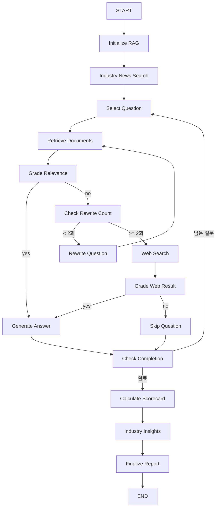

# 시장성 평가 에이전트 (Market Analysis Agent)

AI 스타트업 투자 평가 시스템의 시장성 평가 전문 에이전트 (v0.3.0)

---

## 목차

- [개요](#개요)
- [핵심 기능](#핵심-기능)
- [빠른 시작](#빠른-시작)
- [아키텍처](#아키텍처)
- [사용 방법](#사용-방법)
- [디렉토리 구조](#디렉토리-구조)
- [기술 스택](#기술-스택)
- [출력 형식](#출력-형식)
- [설정 및 커스터마이징](#설정-및-커스터마이징)
- [트러블슈팅](#트러블슈팅)
- [개발 참고 자료](#개발-참고-자료)

---

## 개요

본 에이전트는 **LangGraph 기반 Agentic RAG** 시스템으로, 스타트업 IR 자료(PDF)를 분석하여 시장성을 정량적으로 평가합니다.

### 주요 특징

- Bessemer Checklist 기반 6가지 핵심 질문 분석
- Scorecard Method로 6개 항목 정량 평가 (창업자 30%, 시장성 25%, 제품/기술력 15%, 경쟁 우위 10%, 실적 10%, 투자조건 10%)
- 산업 뉴스 실시간 검색 및 인사이트 분석 (v0.3.0 신규)
- Self-Correction RAG (Query Rewrite + Relevance Check)
- Web Search Fallback (데이터 부족 시 Tavily 검색)
- 무한 루프 방지 (재작성 2회 제한)

### v0.3.0 업데이트

- 산업 뉴스 검색 기능 추가: 시장 동향, 경쟁사 활동, 규제 변화 자동 수집
- 투자 인사이트 분석: LLM 기반 실시간 시장 타이밍 평가
- 답변 프롬프트 개선: 정량 데이터, 비교 분석, 성장 전망 구조화

---

## 핵심 기능

### 1. Bessemer Checklist 분석 (6개 질문)

| 질문 키 | 내용 |
|---------|------|
| market_size | 시장 규모와 성장률 |
| market_problem | 제품이 해결하는 실제 문제 |
| customer_willingness_to_pay | 고객의 지불 의사 및 가격 책정 |
| differentiation | 경쟁사 대비 차별성 |
| revenue_model | 수익 모델의 명확성 |
| risks | 기술, 운영, 법률적 리스크 |

### 2. Scorecard Method 종합 평가

6개 항목별 점수 산출 및 가중평균 계산:

| 항목 | 비중 | 평가 포인트 |
|------|------|------------|
| 창업자 (Owner) | 30% | 전문성, 커뮤니케이션, 실행력 |
| 시장성 (Opportunity Size) | 25% | 시장 크기, 성장 가능성 |
| 제품/기술력 | 15% | 독창성, 구현 가능성 |
| 경쟁 우위 | 10% | 진입장벽, 특허, 네트워크 효과 |
| 실적 | 10% | 매출, 계약, 유저수 |
| 투자조건 (Deal Terms) | 10% | Valuation, 지분율 |

**평가 기준**: 대한민국 AI 스타트업 평균 = 100점
- 120점 이상: 매우 우수
- 100-119점: 우수
- 80-99점: 평균
- 60-79점: 미흡

### 3. 산업 뉴스 인텔리전스 (v0.3.0 신규)

Tavily Search를 통한 실시간 산업 분석:
- 시장 동향 (Market Trends): 최근 3일 내 산업 성장 뉴스
- 경쟁사 활동 (Competitor Moves): 펀딩, M&A, 제휴 소식
- 규제 변화 (Regulatory Changes): 정책, 법률, 인증 업데이트

LLM 기반 투자 인사이트:
- 핵심 인사이트 3가지 자동 추출
- 투자 타이밍 평가 (시장 상황 기반)

### 4. Agentic RAG 워크플로우

```
START → Initialize (RAG 구축)
     → Industry News (산업 뉴스 검색) [v0.3.0]
     → Select Question (질문 선택)
     → Retrieve (문서 검색)
     → Grade Relevance (관련성 평가)
        ├─ yes → Generate Answer
        └─ no → Rewrite (최대 2회)
                 └─ 실패 시 → Web Search Fallback
     → Check Completion (모든 질문 완료?)
        ├─ 남은 질문 → 다음 질문
        └─ 완료 → Scorecard 계산
     → Industry Insights (인사이트 분석) [v0.3.0]
     → Finalize (보고서 생성)
     → END
```

---

## 빠른 시작

### 1. 환경 설정

프로젝트 루트의 `.env` 파일에 필수 API 키 설정:

```bash
OPENAI_API_KEY=sk-...
TAVILY_API_KEY=tvly-...  # 웹 검색 및 뉴스 검색용
```

### 2. 의존성 설치

```bash
# 프로젝트 루트에서 실행
cd skala-gai
pip install -r requirements.txt

# 또는 Poetry 사용
poetry install
```

### 3. 실행

```bash
cd market-analysis-agent

# IR 자료 PDF를 data/ 폴더에 준비
# 예: data/qure.ai.pdf

# 에이전트 실행
python test_agent.py
```

**실행 절차:**
1. 기업 이름 입력 (예: Qure.ai)
2. data/ 폴더의 PDF 자동 검색 및 선택
3. 분석 자동 실행 (약 2-3분 소요)
4. 결과 저장: `outputs/{기업명}_market_analysis.json`

---

## 아키텍처

### 전체 시스템 구조

```
메인 투자 평가 시스템
├── 스타트업 탐색
├── 기술 요약
├── [시장성 평가] ← 본 에이전트
├── 경쟁사 비교
├── 투자 판단
└── 보고서 생성
```

### 에이전트 내부 그래프 (v0.3.0)



---

## 사용 방법

### 독립 실행

```python
from market_analyst import market_analyst_agent

result = market_analyst_agent(
    startup_name="Qure.ai",
    document_path="data/qure.ai.pdf"
)

print(result["scorecard_method"]["market_score"])  # 102
print(result["industry_intelligence"]["industry_category"])  # Healthcare AI
```

### 메인 그래프 통합

```python
from langgraph.graph import StateGraph
from market_analyst import market_analyst_node

# 메인 그래프 State 정의
class MainGraphState(TypedDict):
    startup_name: str
    document_path: str
    market_analysis: dict  # 이 에이전트가 채울 부분
    # ...

# 그래프 구성
main_workflow = StateGraph(MainGraphState)
main_workflow.add_node("market_eval", market_analyst_node)

# 엣지 연결
main_workflow.add_edge("tech_summary", "market_eval")
main_workflow.add_edge("market_eval", "competitor_analysis")
```

---

## 디렉토리 구조

```
market-analysis-agent/
├── agents/
│   ├── state.py                # State 정의 (industry_news, industry_insights 포함)
│   ├── nodes.py                # 12개 노드 함수 (뉴스 검색, 인사이트 분석 포함)
│   └── graph.py                # LangGraph 워크플로우 (v0.3.0)
├── prompts/
│   ├── bessemer_questions.py   # 6개 Bessemer 질문
│   ├── query_rewrite_prompt.py # Query Rewrite 프롬프트
│   └── scorecard_prompt.py     # 6개 항목 Scorecard 프롬프트
├── utils/
│   └── rag_tools.py            # RAG 파이프라인 (PDF → FAISS)
├── data/                       # 분석 대상 PDF
├── outputs/                    # 분석 결과 JSON
├── market_analyst.py           # 메인 인터페이스
├── test_agent.py               # 실행 스크립트
└── README.md                   # 본 문서
```

---

## 기술 스택

| 카테고리 | 도구 | 용도 |
|----------|------|------|
| 프레임워크 | LangGraph, LangChain | 에이전트 워크플로우 |
| LLM | OpenAI GPT-4o-mini | 답변 생성, 인사이트 분석 |
| 임베딩 | OpenAI text-embedding-3-small | 문서 벡터화 |
| 벡터 스토어 | FAISS | 로컬 벡터 검색 |
| 웹 검색 | Tavily Search | 실시간 뉴스 검색 |
| 평가기 | GroundednessChecker | 관련성 평가 |
| 문서 로더 | PyPDFLoader | PDF 파싱 |
| 텍스트 분할 | RecursiveCharacterTextSplitter | 청크 분할 |

---

## 출력 형식

### JSON 구조

```json
{
  "startup_name": "Qure.ai",
  "analysis_type": "Market Analysis (시장성 평가)",
  "analysis_date": "2025-04-16",

  "bessemer_checklist": {
    "market_size": {
      "question": "이 시장은 얼마나 큰가?",
      "answer": "- 핵심 답변: 글로벌 의료 AI 시장 $45B (2024), 2030년 $188B 전망\n- 상세 분석:\n  - 정량 데이터: CAGR 23%\n  - 비교 분석: 헬스케어 IT 평균 15% 대비 1.5배 빠름\n  - 성장 전망: FDA 승인 가속화로 급성장 예상\n- 출처: 페이지 3, Market Overview",
      "rewrite_count": 0,
      "fallback_used": false,
      "status": "success"
    },
    "market_problem": { ... },
    "customer_willingness_to_pay": { ... },
    "differentiation": { ... },
    "revenue_model": { ... },
    "risks": { ... }
  },

  "scorecard_method": {
    "market_score": 102,
    "weight_percentage": 25,
    "weighted_contribution": 25.5,
    "reasoning": "**종합 점수: 102점**\n\n항목별 평가:\n1. 창업자 (30%): 105점 - 의료 AI 전문 배경, 강력한 실행력\n2. 시장성 (25%): 115점 - 급성장 시장, CAGR 23%\n3. 제품/기술력 (15%): 110점 - 24개 특허, FDA 승인\n4. 경쟁 우위 (10%): 95점 - 유연한 통합, 글로벌 확장\n5. 실적 (10%): 85점 - 70개국 1500개 사이트 운영\n6. 투자조건 (10%): 100점 - 평균 수준\n\n종합 의견: 시장성과 기술력이 우수하며, 투자 매력도 높음"
  },

  "industry_intelligence": {
    "industry_category": "Healthcare AI",
    "news_summary": "**핵심 인사이트 1**: 의료 AI 시장은 FDA 승인 가속화로 2025년 급성장 예상\n**핵심 인사이트 2**: 경쟁사 3곳이 이번 주 총 $80M 투자 유치, 시장 검증됨\n**핵심 인사이트 3**: 유럽 GDPR 강화로 데이터 보안 요구사항 증가\n\n**투자 타이밍 평가**: 현재 시장은 규제 완화와 투자 활성화로 진입 최적기이나, 경쟁 심화로 차별화 전략 필수",
    "total_news_analyzed": 12,
    "key_trends": [
      "Healthcare AI market projected to reach $188B by 2030 - TechCrunch",
      "FDA approves 3 new AI diagnostic tools this week - Reuters"
    ],
    "competitor_activity": [
      "Zebra Medical raises $50M Series D - Bloomberg",
      "Aidoc partners with GE Healthcare - FierceHealthcare"
    ],
    "regulatory_updates": [
      "EU AI Act implementation delayed to Q3 2025 - Reuters"
    ],
    "search_date": "2025-10-13"
  },

  "summary": {
    "market_score": 102,
    "weight_percentage": 25,
    "success_count": 6,
    "failed_count": 0
  }
}
```

---

## 설정 및 커스터마이징

### Bessemer 질문 수정

`prompts/bessemer_questions.py` 파일에서 질문 추가/수정:

```python
BESSEMER_MARKET_QUESTIONS = [
    {
        "key": "custom_question",
        "question": "커스텀 질문 내용",
        "description": "질문 설명"
    }
]
```

### Scorecard 비중 조정

`prompts/scorecard_prompt.py` 파일에서 항목 비중 수정:

```python
## Scorecard 평가 항목 및 비중
1. **창업자 (Owner)** - 30%  # 비중 조정 가능
2. **시장성 (Opportunity Size)** - 25%
...
```

### RAG 파이프라인 설정

`utils/rag_tools.py`에서 청크 크기 조정:

```python
retriever = setup_rag_pipeline(
    pdf_path="data/ir.pdf",
    chunk_size=1000,      # 기본 1000, 조정 가능
    chunk_overlap=200     # 기본 200, 조정 가능
)
```

### Query Rewrite 재시도 횟수

`agents/graph.py`에서 재작성 제한 변경:

```python
def route_after_rewrite_check(state: MarketAnalysisState) -> str:
    if state["rewrite_count"] < 2:  # 기본 2회, 조정 가능
        return "rewrite_question"
```

---

## 트러블슈팅

### 1. PDF 로딩 실패

**증상:**
```
[ERROR] RAG 파이프라인 구축 실패: No such file or directory
```

**해결:**
- `data/` 폴더 존재 여부 확인
- PDF 파일 경로 확인
- 절대 경로 사용 권장

### 2. API 키 오류

**증상:**
```
[ERROR] OpenAI API key not found
```

**해결:**
- 프로젝트 루트의 `.env` 파일 확인
- `OPENAI_API_KEY=sk-...` 형식 확인
- `load_dotenv()` 호출 확인

### 3. Tavily 검색 실패

**증상:**
```
[WARNING] competitor_moves 검색 실패
```

**해결:**
- `.env`에 `TAVILY_API_KEY` 설정 확인
- Tavily 무료 플랜: 1000회/월 제한 확인
- 검색 실패 시 해당 카테고리만 빈 리스트로 처리 (에러 무시)

### 4. 관련성 평가 항상 "no"

**원인:** PDF 내용과 질문이 맞지 않음

**해결:**
- Bessemer 질문을 PDF 도메인에 맞게 수정
- `prompts/bessemer_questions.py` 커스터마이징

### 5. 답변 품질 낮음

**해결:**
- `agents/nodes.py`의 답변 생성 프롬프트 수정
- RAG 청크 크기 조정 (더 큰 컨텍스트 필요 시 증가)
- LLM 모델 변경 (gpt-4o-mini → gpt-4o)

---

## 개발 참고 자료

### 코드 패턴 출처

| 기능 | 참고 파일 | 적용 내용 |
|------|----------|----------|
| Query Rewrite | `16-AgenticRAG/04-QueryRewrite.ipynb` | 질문 재작성 프롬프트 |
| Relevance Check | `16-AgenticRAG/02-RelevanceCheck.ipynb` | GroundednessChecker |
| Web Search | `16-AgenticRAG/03-WebSearch.ipynb` | Tavily 검색 Fallback |
| Industry News | `16-AgenticRAG/03-WebSearch.ipynb` | Tavily 뉴스 검색 (v0.3.0) |
| State 패턴 | `22-LangGraph/03-LangGraph-Agent.ipynb` | TypedDict 기반 State |
| Multi-Agent 루프 | `21-Agent/21-Multi-ReportAgent.ipynb` | 조건 분기 및 섹션 순회 |
| 기본 RAG | `15-RAG/01-Basic-PDF.ipynb` | PDF → FAISS 파이프라인 |

### 투자 평가 기준

- **Bessemer Checklist**: [Bessemer Venture Partners](https://www.bvp.com/) 투자 철학
- **Scorecard Method**: Bill Payne의 Scorecard Valuation Methodology
- 참고 문헌: "Angel Investing: The Gust Guide to Making Money and Having Fun Investing in Startups"

### 성능 최적화

- 실행 시간: 약 70-140초 (6개 질문 + 산업 뉴스 검색 포함)
- 비용: 질문당 약 $0.02 (GPT-4o-mini 기준)
- 병렬 처리: 현재 순차 실행, 향후 질문 병렬화 가능

---

## 버전 히스토리

### v0.3.0 (2025-10-13)
- 산업 뉴스 검색 기능 추가 (3개 카테고리: 시장 동향, 경쟁사, 규제)
- LLM 기반 투자 인사이트 분석 노드 추가
- 답변 생성 프롬프트 개선 (정량 데이터, 비교 분석, 성장 전망 구조화)
- test_agent.py 단순화 (기업 이름 입력, PDF 자동 검색)
- State에 industry_category, industry_news, industry_insights 필드 추가

### v0.2.1 (2025-04-16)
- Bessemer 질문 3개 → 6개 확장
- Scorecard Method 종합 평가 (6개 항목)
- 무한 루프 방지 강화
- Query Rewrite 재시도 2회 제한

### v0.1.0 (2025-04-01)
- 초기 버전 릴리스
- 기본 RAG 파이프라인 구축
- Bessemer Checklist 3개 질문 분석

---

## 라이선스 및 기여

본 프로젝트는 SKALA-GAI LangChain Tutorial의 일부입니다.

**문의 및 이슈 제보:** 프로젝트 저장소의 Issues 탭 활용

---

**Last Updated:** 2025-10-13
**Version:** 0.3.0
**Maintainer:** SKALA-GAI Team
