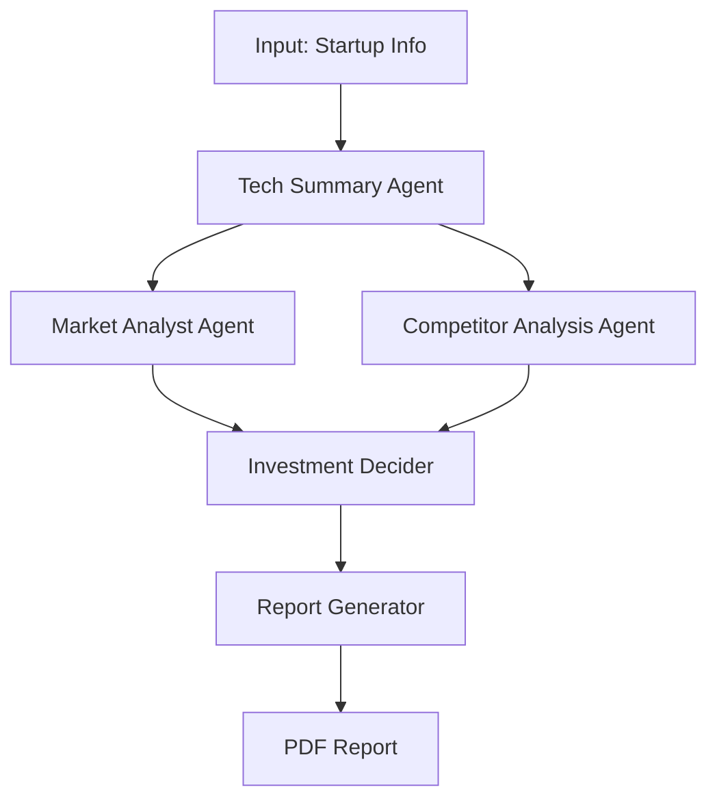

# AI Startup Investment Evaluation Agent
본 프로젝트는 인공지능 스타트업에 대한 투자 가능성을 자동으로 평가하는 에이전트를 설계하고 구현한 실습 프로젝트입니다.
#### Class 1, Team 1
##### Member:
김재민, 김창규, 신민석, 이시언, 정광진

## 🚀 Overview

-   **Objective**: AI 스타트업의 기술력, 시장성, 경쟁 구도 등을 종합적으로 분석하여 투자 적합성을 판단하고, 근거 기반의 상세 보고서를 생성합니다.
-   **Method**: **Agentic RAG**와 **Multi-Agent Collaboration** 시스템을 **LangGraph** 프레임워크를 기반으로 설계했습니다.
-   **Core Engine**: 각 분석 에이전트는 **"자기 수정(Self-Correction)"** 능력을 갖춘 RAG 엔진을 탑재하여, 분석의 정확성과 신뢰도를 극대화합니다.

## ✨ Features

-   **다중 에이전트 협업 워크플로우**: `기술 분석`, `시장성 평가` 등 각 분야 전문가 에이전트들이 유기적으로 협업하여 복잡한 투자 평가 업무를 자동화합니다.
-   **근거 기반의 심층 분석 (Advanced RAG)**:
    -   PDF 문서(IR 자료, 시장 보고서 등)의 내용을 분석하여 모든 평가 결과에 **출처(Citation)를 명시**합니다.
    -   **Query Rewrite**: 검색 품질이 낮을 경우, 에이전트가 스스로 질문을 개선하여 재검색을 시도합니다.
    -   **Web Search Fallback**: 문서에 정보가 없을 경우, 웹 검색을 통해 데이터를 보충하여 정보 누락을 최소화합니다.
-   **자동화된 투자 판단 및 보고**: `Bessemer Checklist`와 `Scorecard Method`를 기반으로 정량적 평가를 수행하고, 그 결과에 따라 후속 작업을 스스로 결정하여 최종 보고서를 생성합니다.

## Tech Stack 

| Category   | Details                                   |
|------------|-------------------------------------------|
| Framework  | LangGraph, LangChain, ReportLab, Python   |
| LLM        | GPT-4o-mini via OpenAI API                |
| Retrieval  | Tavily Web Search API, PDF-based RAG      |
| Storage    | FAISS (market RAG), local PDF assets      |

## Agents
- **기술 요약 에이전트** (`agents/core/tech_summary_agent.py`): 의료 AI 관련 PDF들을 기반으로 핵심 테크 스토리라인을 정리
- **시장성 평가 에이전트** (`agents/market/market_analyst.py`): 산업 뉴스·IR 문서를 RAG로 탐색하고 Bessemer/Scorecard 분석을 수행
- **경쟁사 비교 에이전트** (`agents/competitor/competitor_analysis_agent.py`): Tavily 기반 경쟁사 조사와 6개 차원 비교 분석을 수행
- **투자 판단 에이전트** (`agents/core/estimation_agent.py`): 시장/경쟁 결과를 스코어링해 최종 투자 의사결정을 추천
- **보고서 생성 에이전트** (`agents/core/report_generator_agent.py`): 투자 판단·시장 분석·경쟁사 분석을 결합한 PDF 리포트를 생성

## Architecture


## Directory Structure
```
├── agents/
│   ├── __init__.py
│   ├── core/
│   │   ├── estimation_agent.py
│   │   ├── orchestrator.py
│   │   ├── report_generator_agent.py
│   │   └── tech_summary_agent.py
│   ├── market/
│   │   ├── market_analyst.py
│   │   ├── agents/
│   │   ├── prompts/
│   │   └── utils/
│   ├── competitor/
│   │   ├── competitor_analysis_agent.py
│   │   ├── prompts.py
│   │   └── schemas.py
│   ├── resources/
│   │   ├── docs/
│   │   └── fonts/
│   └── outputs/
│       └── reports/
├── competitor_analysis/
├── README.md
└── ...
```

## Contributors 
- 김재민: 시장성 평가 에이전트 구현
- 김창규: 투자 판단 에이전트 & 보고서 생성 에이전트 구현
- 신민석: 기술 요약 에이전트 구현
- 이시언: 스타트업 정보 수집
- 정광진: 경쟁사 비교 에이전트 구현
