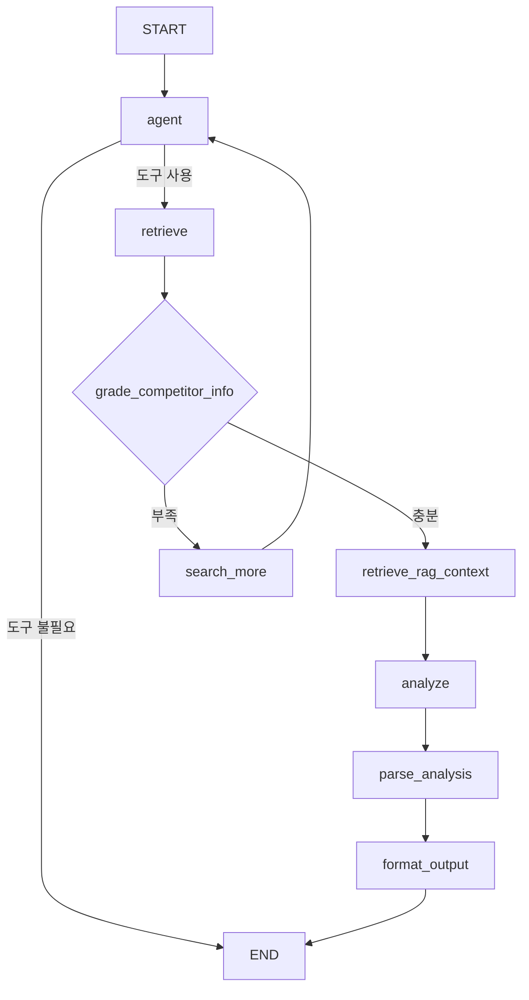

# 경쟁사 비교 에이전트 (Competitor Analysis Agent)

AI 스타트업 투자 평가를 위한 경쟁사 비교 분석 에이전트

## 📁 디렉토리 구조

```
competitor_analysis/
├── data/                           # RAG용 PDF 문서 저장 디렉토리
│   └── vector_store/              # FAISS 인덱스 자동 생성 위치
├── schemas.py                     # Pydantic 스키마 정의
├── prompts.py                     # 프롬프트 템플릿
├── competitor_analysis_agent.py   # 메인 에이전트 로직
├── test_agent.py                  # 테스트 스크립트
└── README.md                      # 이 파일
```

## 🚀 시작하기

### 1. 환경 설정

```bash
# 필요한 패키지 설치 (프로젝트 루트에서)
pip install -r requirements.txt

# .env 파일에 API 키 설정
OPENAI_API_KEY=your_openai_api_key
TAVILY_API_KEY=your_tavily_api_key
```

### 2. 테스트 실행

```bash
cd competitor_analysis
python test_agent.py
```

## 📦 모듈 설명

### 1. `schemas.py`
- **CompetitorAgentState**: LangGraph 상태 정의
- **CompetitorGrade**: 정보 충분성 평가 스키마
- **CompetitorAnalysisParsed**: 분석 결과 파싱 스키마
- **CompetitorAnalysisOutput**: 최종 출력 형식
- **평가 차원 및 가중치**: 6개 평가 차원

### 2. `prompts.py`
프롬프트 템플릿:
- `GRADE_COMPETITOR_INFO_PROMPT`: 정보 충분성 평가
- `COMPETITOR_ANALYSIS_PROMPT`: 경쟁사 비교 분석 (6개 차원)
- `PARSE_ANALYSIS_PROMPT`: 분석 결과 구조화
- `RAG_QUERY_PROMPT`: RAG 검색 쿼리 생성

### 3. `competitor_analysis_agent.py`
메인 에이전트 로직:
- **노드**: `agent`, `retrieve`, `grade_competitor_info`, `search_more`, `retrieve_rag_context`, `analyze`, `parse_analysis`, `format_output`

### 4. `test_agent.py`
테스트 스크립트 (노드 이름 업데이트)

## 🔄 워크플로우



## 📊 분석 체계

### 6개 분석 차원
1. **Technology Differentiation (30%)** - 기술 차별성
2. **Market Entry Barriers (25%)** - 시장 진입장벽
3. **Funding & Growth (20%)** - 펀딩 및 성장성
4. **Partnerships & Ecosystem (15%)** - 파트너십
5. **Validation & Certification (5%)** - 인증 및 검증
6. **Brand Recognition (5%)** - 브랜드 인지도

### Market Positioning (점수 대신)
- **Leader**: 시장 선도 기업 - 대부분 차원에서 명확한 우위
- **Strong Challenger**: 강력한 도전자 - 주요 차원에서 강점
- **Competitive**: 경쟁력 있는 포지션 - 경쟁사와 대등
- **Weak**: 약한 포지션 - 대부분 영역에서 뒤처짐
- **Very Weak**: 매우 약한 포지션 - 심각한 불리함

## 🔗 다른 에이전트와의 통합

### 입력 (기술 요약 에이전트로부터)
```python
{
    "company_name": "Qure.ai",
    "tech_summary": "AI 기반 의료 영상 진단...",
    "core_technologies": ["Deep Learning", "Medical Imaging"],
    "startup_info": {...}
}
```

### 출력 (투자 판단 에이전트로)
```python
{
    "competitors_found": ["Aidoc", "Zebra Medical Vision", "Arterys"],
    "competitive_positioning": "Strong Challenger",
    "competitive_advantages": [
        "FDA 510(k) 인증 확보로 규제 진입장벽 구축",
        "70+ 국가 배포로 글로벌 시장 선점",
        "결핵 진단에 특화된 기술적 차별성"
    ],
    "competitive_disadvantages": [
        "후발주자 대비 펀딩 규모 부족",
        "브랜드 인지도 상대적으로 낮음"
    ],
    "dimension_analysis": {
        "Technology Differentiation": "...",
        "Market Entry Barriers": "...",
        "Funding & Growth": "...",
        "Partnerships & Ecosystem": "...",
        "Validation & Certification": "...",
        "Brand Recognition": "..."
    },
    "competitive_summary": "Qure.ai는 Strong Challenger 포지션으로...",
    "full_analysis": "전체 분석 텍스트..."
}
```

## 🛠️ 주요 기능

1. **웹 검색 기반 경쟁사 발굴** - Tavily API로 실시간 정보 수집
2. **조건부 정보 수집** - 정보 충분성 평가 후 추가 검색
3. **구조화된 6차원 분석** - 가중치 기반 종합 비교 분석
4. **Market Positioning 평가** - 5단계 포지션 평가

## 💡 사용 시나리오

### 시나리오: 다른 에이전트에서 사용
```python
from competitor_analysis import run_competitor_analysis

result = run_competitor_analysis(
    company_name="MyStartup",
    tech_summary="AI-powered...",
    startup_info={"name": "MyStartup", "category": "FinTech"}
)

positioning = result["competitive_positioning"]  # "Strong Challenger"
advantages = result["competitive_advantages"]
disadvantages = result["competitive_disadvantages"]

# 투자 판단 에이전트에서 이 정보를 활용하여 종합 판단
```

## ⚠️ 주의사항

1. **API 키 필수**: `TAVILY_API_KEY`, `OPENAI_API_KEY`
